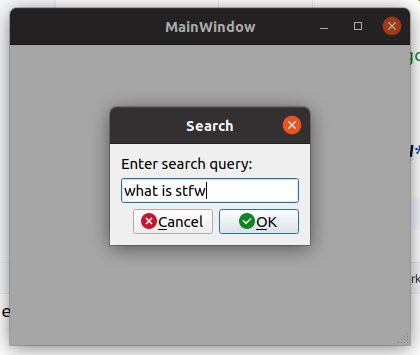

# Go STFW

## Why

Too much confusion these days, either in work or daily life.

We suffer from the unknown.

Search engine resolves this problem for us.

Life becomes happy because of search engines.

This little and rough widget attatch the search engine to your hands tightly.


## How

**OS**

```shell
uname -ar
```

Linux chaowen-System-Product-Name 5.15.0-105-generic #115~20.04.1-Ubuntu SMP Mon Apr 15 17:33:04 UTC 2024 x86_64 x86_64 x86_64 GNU/Linux

**QT**

You can get all you need about QT lib from ubuntu release.
```shell
sudo apt update
sudo apt install qt5-default qtcreator qtbase5-dev qttools5-dev qttools5-dev-tools qt5-qmake qtbase5-dev libqt5x11extras5-dev -y

# if on jammy(22.04), use this
sudo apt install -y qtcreator qtbase5-dev qt5-qmake  qttools5-dev qttools5-dev-tools libqt5x11extras5-dev
```

**QHotkey**

``` shell
# assume you are at the root directory of this project.

cd thirdparty/QHotkey
mkdir build -p && cd build
cmake ..
make
sudo make install
```

**Build**

``` shell
# assume you are at the root directory of this project.

mkdir build -p && cd build
cmake ..
make
```

**Go! STFW!**

Run it, hang it there, don't kill it.

``` shell
# assume you are at the root directory of this project.

./build/go_stfw
```

Hit key combination: `Alt+Q`



Input your confusion.

Hit `Enter`


Congratulations! 

You just accomplish a search operation!


## Why Ubuntu Only

Because there are better tools on windows already.


## License

This project is licensed under the MIT License - see the [LICENSE](https://opensource.org/license/mit) file for details.

## Acknowledgments

    Thanks to the developers of Qt and QHotkey for their excellent libraries.